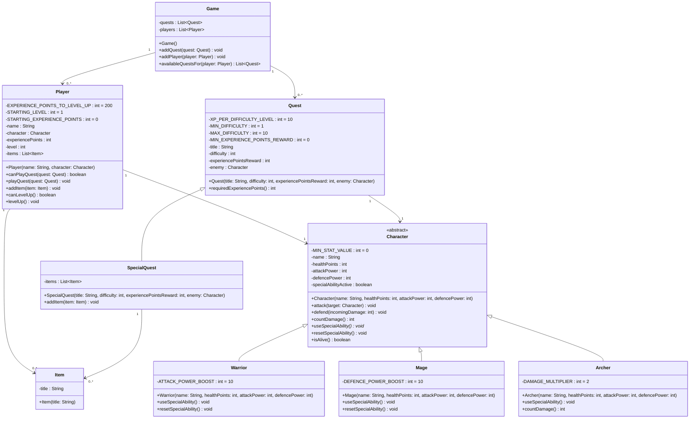

# Week 1 - Kingdoms & Quests

Mirror of `kingdoms_and_quests-week-1.asta`.

```mermaid
classDiagram
    class Character {
        <<abstract>>
        -MIN_STAT_VALUE : int = 0
        -name : String
        -healthPoints : int
        -attackPower : int
        -defencePower : int
        -specialAbilityActive : boolean
        +Character(name: String, healthPoints: int, attackPower: int, defencePower: int)
        +attack(target: Character) void
        +defend(incomingDamage: int) void
        +countDamage() int
        +useSpecialAbility()* void
        +resetSpecialAbility() void
        +isAlive() boolean
    }

    class Warrior {
        -ATTACK_POWER_BOOST : int = 10
        +Warrior(name: String, healthPoints: int, attackPower: int, defencePower: int)
        +useSpecialAbility() void
        +resetSpecialAbility() void
    }

    class Mage {
        -DEFENCE_POWER_BOOST : int = 10
        +Mage(name: String, healthPoints: int, attackPower: int, defencePower: int)
        +useSpecialAbility() void
        +resetSpecialAbility() void
    }

    class Archer {
        -DAMAGE_MULTIPLIER : int = 2
        +Archer(name: String, healthPoints: int, attackPower: int, defencePower: int)
        +useSpecialAbility() void
        +countDamage() int
    }

    class Quest {
        -XP_PER_DIFFICULTY_LEVEL : int = 10
        -MIN_DIFFICULTY : int = 1
        -MAX_DIFFICULTY : int = 10
        -MIN_EXPERIENCE_POINTS_REWARD : int = 0
        -title : String
        -difficulty : int
        -experiencePointsReward : int
        -enemy : Character
        +Quest(title: String, difficulty: int, experiencePointsReward: int, enemy: Character)
        +requiredExperiencePoints() int
    }

    class SpecialQuest {
        -items : List~Item~
        +SpecialQuest(title: String, difficulty: int, experiencePointsReward: int, enemy: Character)
        +addItem(item: Item) void
    }

    class Item {
        -title : String
        +Item(title: String)
    }

    class Player {
        -EXPERIENCE_POINTS_TO_LEVEL_UP : int = 200
        -STARTING_LEVEL : int = 1
        -STARTING_EXPERIENCE_POINTS : int = 0
        -name : String
        -character : Character
        -experiencePoints : int
        -level : int
        -items : List~Item~
        +Player(name: String, character: Character)
        +canPlayQuest(quest: Quest) boolean
        +playQuest(quest: Quest) void
        +addItem(item: Item) void
        +canLevelUp() boolean
        +levelUp() void
    }

    class Game {
        -quests : List~Quest~
        -players : List~Player~
        +Game()
        +addQuest(quest: Quest) void
        +addPlayer(player: Player) void
        +availableQuestsFor(player: Player) List~Quest~
    }

    Character <|-- Warrior
    Character <|-- Mage
    Character <|-- Archer
    Quest <|-- SpecialQuest

    Game "1" --> "0..*" Quest
    Game "1" --> "0..*" Player
    Player "1" --> "1" Character
    Player "1" --> "0..*" Item
    Quest "1" --> "1" Character
    SpecialQuest "1" --> "0..*" Item
```
