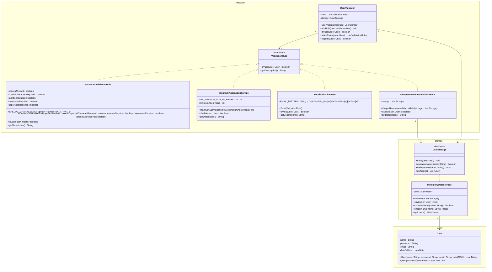

# Week 2 - User Validation

Mirror of `user_validation-week-2.asta`. Classes are grouped in the packages `user`, `storage` and `validation` under `com.nhlstenden.week2`.

```mermaid
classDiagram
    namespace user {
        class User {
            -name : String
            -password : String
            -email : String
            -dateOfBirth : LocalDate
            +User(name: String, password: String, email: String, dateOfBirth: LocalDate)
            +getAgeInYears(dateOfBirth: LocalDate) int
        }
    }

    namespace storage {
        class UserStorage {
            <<interface>>
            +save(user: User) void
            +containsName(name: String) boolean
            +findByName(name: String) User
            +getUsers() List~User~
        }

        class InMemoryUserStorage {
            -users : List~User~
            +InMemoryUserStorage()
            +save(user: User) void
            +containsName(name: String) boolean
            +findByName(name: String) User
            +getUsers() List~User~
        }
    }

    namespace validation {
        class ValidationRule {
            <<interface>>
            +isValid(user: User) boolean
            +getDescription() String
        }

        class UserValidator {
            -rules : List~ValidationRule~
            -storage : UserStorage
            +UserValidator(storage: UserStorage)
            +addRule(rule: ValidationRule) void
            +isValid(user: User) boolean
            +failedRules(user: User) List~ValidationRule~
            +register(user: User) boolean
        }

        class PasswordValidationRule {
            +SPECIAL_CHARACTERS : String = "!@#$%^&*()-_=+?.,:;"
            -spacesAllowed : boolean
            -specialCharacterRequired : boolean
            -numberRequired : boolean
            -lowercaseRequired : boolean
            -uppercaseRequired : boolean
            +PasswordValidationRule(spacesAllowed: boolean, specialCharacterRequired: boolean, numberRequired: boolean, lowercaseRequired: boolean, uppercaseRequired: boolean)
            +isValid(user: User) boolean
            +getDescription() String
        }

        class MinimumAgeValidationRule {
            -MIN_MINIMUM_AGE_IN_YEARS : int = 0
            -minimumAgeInYears : int
            +MinimumAgeValidationRule(minimumAgeInYears: int)
            +isValid(user: User) boolean
            +getDescription() String
        }

        class EmailValidationRule {
            -EMAIL_PATTERN : String = "^[A-Za-z0-9._%+-]+@[A-Za-z0-9.-]+[.][A-Za-z]+$"
            +EmailValidationRule()
            +isValid(user: User) boolean
            +getDescription() String
        }

        class UniqueUsernameValidationRule {
            -storage : UserStorage
            +UniqueUsernameValidationRule(storage: UserStorage)
            +isValid(user: User) boolean
            +getDescription() String
        }
    }

    ValidationRule <|.. PasswordValidationRule
    ValidationRule <|.. MinimumAgeValidationRule
    ValidationRule <|.. EmailValidationRule
    ValidationRule <|.. UniqueUsernameValidationRule
    UserStorage <|.. InMemoryUserStorage

    UserValidator "1" --> "0..*" ValidationRule
    UserValidator "1" --> "1" UserStorage
    UniqueUsernameValidationRule "1" --> "1" UserStorage
    InMemoryUserStorage "1" --> "0..*" User
```
